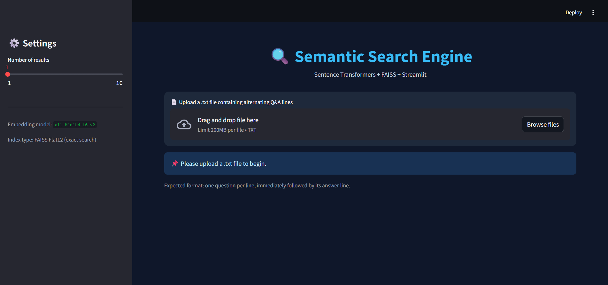
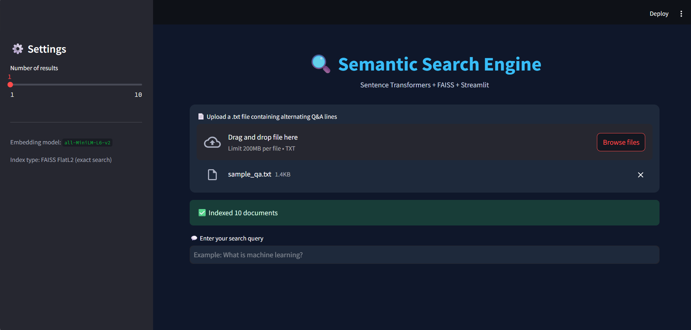
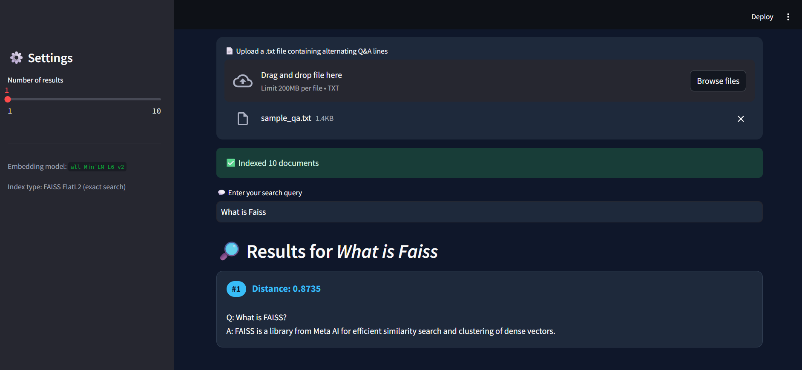

# 🔍 Semantic Search Engine

[](https://github.com/Gayathri-Reddy874/semantic-search-engine-faiss/actions/workflows/ci.yml)
[](https://www.python.org/downloads/)
[](https://streamlit.io/)
[](https://github.com/facebookresearch/faiss)
[](tests/)
[](LICENSE)

A production-style semantic search application: upload a plain-text knowledge base,
embed it with a Sentence Transformer, index it with FAISS, and query it in natural
language through a Streamlit UI.

This started as a single-file Colab script and was refactored into a modular,
tested, containerized project - the structure a hiring manager expects to see
in a real engineering codebase.

## Features

- **Semantic (meaning-based) search** - not keyword matching - powered by
  `sentence-transformers` embeddings and a FAISS `IndexFlatL2` similarity index.
- **Layered architecture** - UI (`app.py`), configuration, embeddings, document
  loading, and search are separated into independent, unit-tested modules.
- **Content-hash caching** - the index is only rebuilt when the uploaded file's
  content actually changes, not on every Streamlit rerun.
- **Persistence** — `SemanticSearchEngine.save()` / `.load()` let you serialize
  an index to disk and reload it without re-embedding.
- **Error handling** — invalid, empty, or oversized uploads fail gracefully with
  a clear message instead of a stack trace.
- **Automated tests** — 12 unit tests covering the document loader and search
  engine, including edge cases (empty index, empty query, odd line counts).
- **Dockerized** — one command to build and run the app anywhere.
- **CI-ready** — GitHub Actions workflow lints and tests on every push/PR.

## Screenshots

**Empty state — upload prompt**


**File uploaded and indexed**


**Search results**


## Architecture

```
Uploaded .txt file
        │
        ▼
 document_loader.py   →  parses alternating Q/A lines into documents
        │
        ▼
 embeddings.py         →  SentenceTransformer("all-MiniLM-L6-v2") → float32 vectors
        │
        ▼
 search_engine.py      →  FAISS IndexFlatL2: build_index() / search() / save() / load()
        │
        ▼
 app.py (Streamlit)    →  file upload, query input, ranked result cards
```

## Tech Stack

| Layer            | Technology                              |
|-------------------|------------------------------------------|
| UI                | Streamlit                               |
| Embeddings        | sentence-transformers (`all-MiniLM-L6-v2`) |
| Vector search      | FAISS (`faiss-cpu`)                     |
| Testing            | pytest                                  |
| Containerization   | Docker                                  |
| CI                 | GitHub Actions                          |

## Project Structure

```
semantic-search-engine/
├── app.py                        # Streamlit entry point (UI only)
├── src/
│   ├── config.py                 # Centralized, env-overridable settings
│   ├── logger.py                 # Shared logging setup
│   ├── document_loader.py        # Parses uploaded .txt into documents
│   ├── embeddings.py             # SentenceTransformer wrapper
│   └── search_engine.py          # FAISS index build / search / save / load
├── tests/
│   ├── test_document_loader.py
│   └── test_search_engine.py
├── sample_data/
│   └── sample_qa.txt             # Example Q&A file to try the app with
├── .github/workflows/ci.yml      # Lint + test on every push
├── requirements.txt              # Runtime dependencies
├── requirements-dev.txt          # + testing/linting tools
├── Dockerfile
├── .dockerignore
└── .gitignore
```

## Setup & Installation

```bash
git clone https://github.com/Gayathri-Reddy874/semantic-search-engine-faiss.git
cd semantic-search-engine-faiss
python -m venv venv
source venv/bin/activate      # Windows: venv\Scripts\activate
pip install -r requirements.txt
```

## Usage

```bash
streamlit run app.py
```

Then open the local URL Streamlit prints (usually `http://localhost:8501`), upload
`sample_data/sample_qa.txt` (or your own file in the same format), and search.

**Expected input format** — alternating question/answer lines:

```
What is machine learning?
Machine learning is a field of AI where systems learn from data.
What is FAISS?
FAISS is a library for efficient similarity search over dense vectors.
```

## Running Tests

```bash
pip install -r requirements-dev.txt
pytest --cov=src --cov-report=term-missing
```

12 tests cover: document parsing (even/odd line counts, blank lines, missing/empty
files) and the search engine (build/search/save/load, empty-index and empty-query
error handling, top-k capping).

## Docker

```bash
docker build -t semantic-search-engine .
docker run -p 8501:8501 semantic-search-engine
```

## Design Decisions

- **`IndexFlatL2` over an approximate index (e.g. HNSW/IVF):** exact search is
  fast enough at the scale a demo/portfolio knowledge base needs, and it avoids
  tuning approximate-search parameters. Swapping in `IndexHNSWFlat` later only
  touches `search_engine.py`.
- **Content-hash cache key:** using the file's SHA-256 hash (not filename) as the
  Streamlit cache key means re-uploading an unchanged file is instant, while an
  edited file with the same name still triggers a fresh index.
- **`TypedDict` for search results:** keeps the return shape explicit and
  type-checkable without pulling in a full schema library like Pydantic for
  something this small.

## Future Improvements

- Support additional input formats (CSV, JSON, PDF) via pluggable loaders.
- Swap `IndexFlatL2` for `IndexHNSWFlat` or `IndexIVFFlat` for larger corpora.
- Add a hybrid search mode (BM25 + semantic) for better precision on exact terms.
- Add a `/save` and `/load` UI action so users can persist an index across sessions.
- Deploy to Streamlit Community Cloud or a small cloud VM behind the Docker image.

## Author

**Mallareddygari Gayathri**
AI/ML Engineering graduate | Aspiring Data Analyst → Data Scientist / AI-ML Engineer

- GitHub: [Gayathri-Reddy874](https://github.com/Gayathri-Reddy874)
- LinkedIn: [add your LinkedIn URL here]

## License

MIT — free to use and adapt for your own portfolio.
